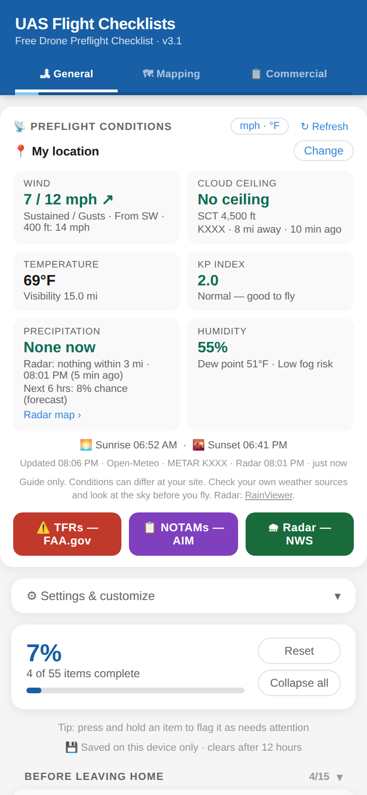
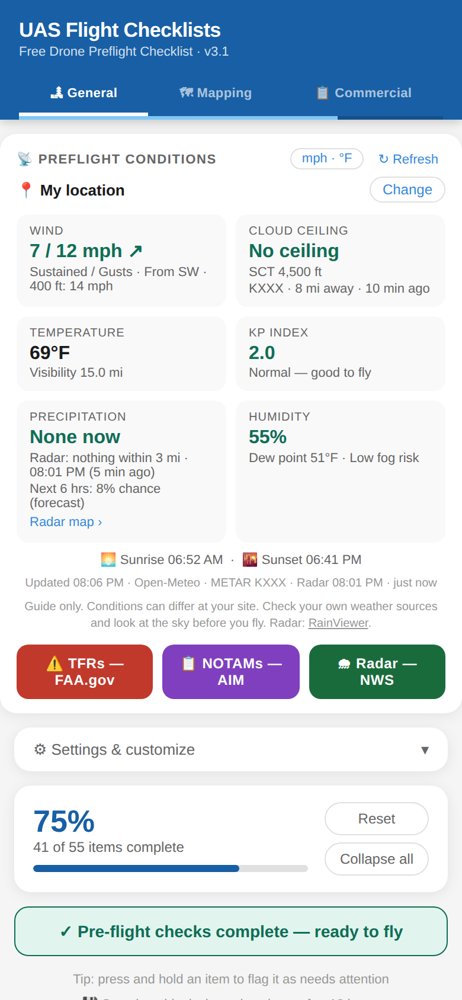
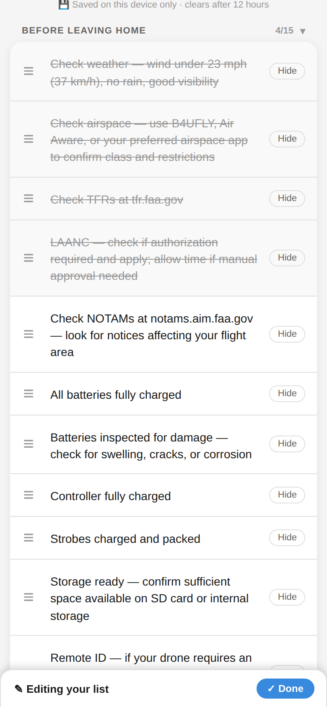
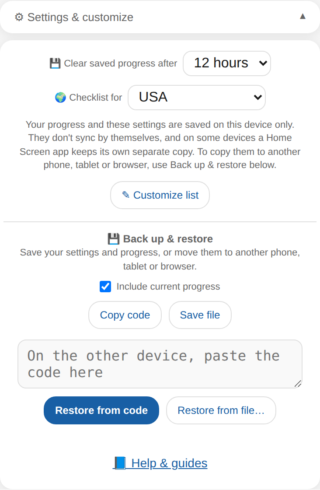
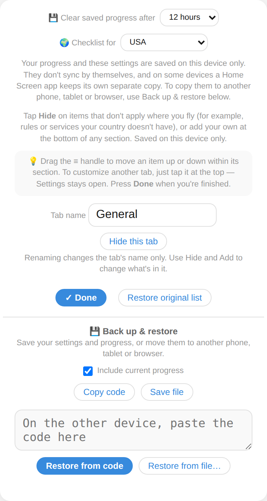

# UAS Flight Checklists

A free, mobile-friendly drone preflight checklist web app with live weather conditions built in. It works for recreational and commercial pilots in any country — hide the items that don't apply to you, add your own, put things in the order you fly them, and back it all up. No app to download, no subscription required — just open it in any browser and fly.

**Use it now:** [checklist.johnstonaerial.com](https://checklist.johnstonaerial.com)

📘 **New here?** See the [How-to guides](HOW-TO.md): make your own profiles (with a real timelapse example), use it with no signal, use it outside the USA, and check TFRs and NOTAMs (USA). Inside the app, tap **⚙ Settings & customize → 📘 Help & guides**.

---

## Screenshots

<table>
  <tr>
    <td align="center" width="33%"> <b>Live weather and checklist</b></td>
    <td align="center" width="33%"> <b>"Ready to fly" banner</b></td>
    <td align="center" width="33%"> <b>Customize: drag, hide, add</b></td>
  </tr>
  <tr>
    <td align="center"> <b>Settings &amp; Back up / restore</b></td>
    <td align="center"> <b>Rename or hide tabs</b></td>
    <td></td>
  </tr>
</table>

---

## What's new in v3.2.2

The weather card now tells you when your phone has no signal:

- **Offline note on resume** — if you leave the app, lose signal, and come back, the last readings stay on screen with **📴 No signal — weather isn't updating. Showing data from [time].** You no longer have to tap Refresh to find out
- **Instant message when opened offline** — with no signal at all, you see **📴 No signal — can't load the weather** straight away instead of a long "Loading…"
- **Refreshes itself when signal returns** — the note clears and the weather updates on its own
- A weak or flaky connection behaves as before (it retries once, then keeps your last readings with a "Couldn't refresh" note)

---

## What's new in v3.2.1

A small fix on the weather card (USA setting):

- **Low visibility is flagged** — visibility under 3 miles now shows in red with **⛔ Below 3 mi minimum**, so it no longer depends on reading the number
- **Humidity says why it's red** — when fog is likely *and* visibility is under 3 miles, the line reads *Fog likely, visibility under 3 mi*

---

## What's new in v3.2

Version 3.2 makes the checklist work in more places and for more people:

- **Works with no signal** — open it once with a connection and it opens again with none (for example at a remote site). The checklist, your own items and your settings all work offline; weather says so and refreshes when you're back online. When you do have a signal you always get the newest version
- **Max altitude line (USA)** — when the cloud ceiling is above 500 ft but below 900 ft, the Cloud Ceiling card adds **Max legal altitude about … ft AGL (500 ft below clouds)**, so you know how high you can actually go. A ceiling of **500 ft or lower is now red: Cannot fly**
- **Night notice** — after sunset or before sunrise the weather card reminds you what night flying needs (in the USA, an anti-collision light visible for 3 miles; elsewhere, check your local rules). It follows the clock, even if the weather hasn't refreshed
- **Best window is smarter** — when it is raining now, it shows the *longest* dry stretch of at least 2 hours in the next 12 hours, not just the next dry hour
- **Humidity** — fog risk is amber; it turns red only when fog is likely and visibility is already under 3 miles
- **Far-away flight sites** — if your flight site is in a different time zone, rain, storm and sunrise/sunset times are marked **(site time)**
- **Clear messages when something fails** — weather, airport reports, KP index, place search and location lookups now time out after 12 seconds with plain wording ("Airport reports unavailable — check another source") instead of showing a misleading number
- **Easier to read and use** — screen-reader labels and announcements (checklist items, tabs and weather updates), keyboard control, larger touch targets, better text contrast, 16 px form fields so iPhones don't zoom in, a layout that fits very small phones, and pinch-to-zoom is no longer blocked
- **📘 Help & guides** link in ⚙ Settings, and a new [How-to guides](HOW-TO.md) page: make your own profiles (with a real timelapse example), use it with no signal, use it outside the USA, and check TFRs and NOTAMs

---

## What's new in v3.1

Version 3.1 makes the weather card much more useful on a rainy or low-cloud day:

- **Cloud ceiling from the lowest nearby station** — it checks every airport weather report within 30 miles and shows the lowest ceiling (with the station, distance and age), the cautious choice. A **Lowest cloud nearby** line helps with the cloud-clearance rule
- **Precipitation card** — combines live **radar** (RainViewer, free), **airport weather reports** and the forecast. Headlines include *Precip. nearby*, *Precip. likely*, the airport's own wording (for example *Light rain*), and *Rain possible* when only the forecast thinks so — with a note when radar doesn't see it
- **Look-ahead lines** — *Rain likely ~4 PM*, *Best window ~8 PM – 2 AM*, *No clear window next 12 hrs* and *Storms possible*, shown only when there is something to say
- **Humidity card** with dew point and a fog / lens-fogging warning
- **Radar — NWS button opens on your location**
- **Source footer** — lists where each reading came from (forecast, airport station, radar time)
- **Weak signal friendly** — if a refresh fails, the last good reading stays on screen with a short note, and the app retries once
- Guide only: always check your own weather sources and look at the sky before you fly

---

## What's new in v3.0

Version 3 is a major update built around making the checklist *yours*:

- **⚙ Settings & customize panel** — everything that configures the checklist now lives in one tidy, collapsible panel at the top of each tab: how long progress is kept, where you fly (USA or outside), Customize, tab names, and backup
- **Reorder items** — in Customize mode, drag the **≡** handle to move any item up or down within its section
- **Back up & restore** — copy a code or save a file of your settings (and, optionally, your current progress), then restore it on another phone, tablet or browser — or on the same one after a reset
- **Two-stage banner** — a green banner tells you when your pre-flight checks are done (**ready to fly**) and again when the whole flight is finished (**flight complete**)
- **Floating Done bar** — while you customize, a bar stays pinned to the bottom of the screen with a **Done** button, so you never have to scroll back to finish
- **Tabs stay out of your way** — switch tabs while customizing and Settings stays open, so you can tidy several tabs in one pass
- **Cleaner layout** — the progress bar sits right above the checklist with **Reset** and **Collapse all / Expand all** beside it; **Expand all** appears as soon as any section is folded
- **Upgrading is safe** — saved progress, hidden and added items, region, units and fold state carry over from v2.x

---

## Features

- **3 mission-specific tabs** — General, Mapping, and Commercial (rename or hide any of them)
- **Live Preflight Conditions panel** showing:
  - Wind speed, gusts, and direction arrow, plus wind at 400 ft
  - Cloud ceiling in feet AGL from nearest METAR station
  - Temperature and visibility
  - KP Index (space weather / GPS interference risk)
  - Sunrise and sunset times
- **Choose your flight site** — check weather for where you're going, not just where you are; recent sites are remembered on your device
- **One-tap buttons** for TFRs, NOTAMs, and NWS Radar (see [How-to guides](HOW-TO.md#check-tfrs-and-notams-before-you-fly-usa) for how to read them)
- **Progress tracker** — percentage complete per tab, with a **ready to fly** banner when your pre-flight sections are done and a **flight complete** banner when everything is
- **Works outside the USA** — the first time you open it, choose **USA** or **Outside the USA**. Choosing outside the USA hides the US-only items (TFR and LAANC checks), rewords the NOTAM and airspace items so they aren't tied to US websites, removes the FAA/NWS buttons under the weather panel, and switches the weather to metric. Change it any time in **⚙ Settings**
- **Customize the list** — open **⚙ Settings & customize** and tap **✎ Customize list** to hide items that don't apply where you fly, add your own items to any section, and drag items into the order you prefer. Hidden items don't count toward progress, and checks follow an item when you move it. **Restore original list** puts the tab back to the defaults
- **Rename or hide tabs** — in Customize mode, rename the tab you're on or hide it (at least one tab always stays), and bring hidden tabs back from any tab. Renaming changes the tab's name only; use Hide and Add to change what's inside it
- **Back up & restore** — see below
- **Collapsible sections** — tap a section header to fold it up or open it, or use **Collapse all / Expand all**. Each header shows its count (like 9/12), a ✓ when it's finished and an amber ⚠ if something in it needs attention, even when folded. Your fold state is remembered
- **Progress is saved on your device** — checks and flags survive a reload or an accidental app close, and expire so the next flight starts clean. The default is 12 hours; change it in Settings (1 hour, 4 hours, 12 hours, 24 hours or 3 days)
- **Imperial / metric toggle** — tap the units button in the weather panel to switch wind, temperature, visibility and ceiling between mph/°F/mi/ft and km/h/°C/km/m; your choice is remembered
- **Weather shows its age** — the "Updated" line turns amber after 30 minutes, and weather auto-refreshes when you return to the app after 10+ minutes
- **Flag items that need attention** — press and hold any item to mark it amber; flagged items don't count as complete until you resolve them
- **Works on any device** — phone, tablet, desktop, or dedicated controller screen
- **Completely free** to host and run

---

## Back up & restore

Your settings and progress are stored in the browser on the device you're using. They don't sync by themselves, and a checklist added to your Home Screen can keep its own separate copy from the browser tab (iPhones and iPads always do). It works the same on any phone, tablet or computer, in any current browser. **Back up & restore** (in ⚙ Settings, and also visible while you customize) lets you move them. It also lets you keep several setups and switch between them. See [Make your own profiles](HOW-TO.md#make-your-own-profiles).

**To back up or move to another device**
1. Open **⚙ Settings & customize** and find **Back up & restore**
2. Choose whether to **Include current progress** (leave it off to move only your settings)
3. Tap **Copy code** to copy a code you can paste into a message or note, or **Save file** to save or share a small backup file

**To restore**
1. On the other device, open **⚙ Settings & customize**
2. Paste the code and tap **Restore from code**, or tap **Restore from file…** and choose your backup
3. Confirm — the checklist reloads, collapses Settings and scrolls to the top, and a short message confirms it worked

Restoring **replaces** that device's settings with the backup. A backup includes your region, units, tab names and hidden tabs, hidden/added/reordered items, fold state, recent flight sites and progress retention — and, if you chose it, your checks and flags. Progress that has already expired is not restored.

---

## Setup

**Live weather works out of the box — no account or API key needed.** Wind, gusts, wind at 400 ft, temperature, visibility, sunrise/sunset, cloud ceiling, and KP index all load automatically.

### Cloud ceiling (optional: run your own proxy)

Cloud ceiling comes from real METAR reports from the FAA/NWS [Aviation Weather Center](https://aviationweather.gov), which needs no key but blocks direct browser requests. The checklist reaches it through a tiny Cloudflare Worker (`uas-metar-worker.js` in this repo) that holds no secrets. This deployment already points at one, so a fork works as-is. To run your own:

1. Create a free [Cloudflare](https://cloudflare.com) account → **Workers & Pages → Create → Hello World**
2. Paste in the contents of `uas-metar-worker.js` and deploy
3. In `index.html`, set `METAR_PROXY` to your Worker's URL

### Host it

The simplest way is GitHub Pages:

1. Fork this repo
2. Go to **Settings → Pages → Source → main branch** → Save
3. Your checklist will be live at `yourusername.github.io/uas-flight-checklist`

Or simply download `index.html` and open it locally in any browser. The weather panel won't work on local `file://` URLs due to browser security restrictions — you'll need it hosted on HTTPS (GitHub Pages is free and perfect for this).

---

## How to Use

1. Open the checklist on your device before your flight
2. Select the tab that matches your mission type
3. Review the **Preflight Conditions** panel — tap **↻ Refresh** to update weather. It shows your current location by default; tap **Change** to look up a different flight site, and **Use my location** to switch back
4. Tap each item to check it off as you complete it
5. Press and hold an item to flag it as **needs attention** (amber). Tap a flagged item once it's resolved to check it off
6. The progress bar tracks your completion percentage and shows how many items need attention. When your pre-flight sections are done, a **ready to fly** banner appears; after the last section, **flight complete**
7. Tap **Reset** (next to the progress bar) to clear all checks and flags on the current tab — it asks you to confirm first

**To make it yours:** open **⚙ Settings & customize**, tap **✎ Customize list**, and hide, add, drag or rename what you need — then press **Done** in the bar at the bottom. Before you leave Settings, consider saving a backup. More in the [How-to guides](HOW-TO.md).

---

## FAQ

**Is it really free?**
Yes. There's no app to buy, no subscription, no ads and no account. It's an open-source web page (MIT license).

**Does it replace my official checks or the regulations?**
No. It's a memory aid. The pilot in command is responsible for knowing and following the rules where they fly. The default items and limits (for example the wind and altitude numbers) reflect US FAA guidance, so check your local rules and use **Customize** to change anything that doesn't fit your operation.

**What information does it collect?**
None about you. There are no accounts, no analytics and no tracking in the page. Your checks, settings and notes stay in your browser's storage on your device. To show weather, the page sends the coordinates of your location (or the flight site you choose) to the free weather services listed under *Built With*, and the text you type in "Change" to look up a place. It's hosted on GitHub Pages, which, like any web host, keeps its own standard server logs.

**Why does it ask for my location?**
To show weather for where you are. If you say no, tap **Change** and search for a town, ZIP code or coordinates instead.

**Does it work offline?**
Yes. Open it once with a connection and it opens again with none, and your checks keep saving. Live weather, radar, KP index, airport reports and place search need a connection. When you're back online the app loads the newest version. On an iPhone or iPad, open the Home Screen icon once with a signal too, since it keeps its own storage. See [Use it with no signal](HOW-TO.md#use-it-with-no-signal).

**How do I put it on my Home Screen like an app?**
- **iPhone / iPad (Safari):** tap Share → **Add to Home Screen**
- **Android (Chrome):** tap the ⋮ menu → **Install app** (or **Add to Home screen**)
- **Computer (Chrome or Edge):** click the install icon at the right end of the address bar

On an iPhone or iPad the Home Screen app keeps its own saved data, separate from Safari, so set it up once and use that one. Use **Back up & restore** to bring your settings across.

**I changed phones, or cleared my browser data. Did I lose my settings?**
Your settings live in the browser, so clearing site data erases them. Use **Back up & restore** to save a backup code or file ahead of time and restore it later.

**Can I move an item to a different section?**
Not yet. You can reorder items within their section, hide items you don't want, and add your own items to any section.

**Can I use it for my club, school or company?**
Yes. It's free to fork, and you can host your own copy and change the default items (see *Customization* below).

---

## Limitations

- **No automatic sync** — saved progress and settings live only in the browser on the device you're using (and progress is cleared when it expires or when you tap Reset). Use **Back up & restore** to move them to another device. Plan to use a single device per flight.
- **No account or login** — by design. Keeps it simple, private, and free.
- **Backup codes need a recent browser** — codes are compressed using a feature of current browsers (Chrome, Edge, Firefox and Safari from roughly 2023 on, including iOS/iPadOS 16.4 and newer). On older browsers a backup still works but the code is longer.
- **Weather defaults to your current GPS location** — to check a different flight site, tap **Change** on the weather panel and search for a town, ZIP code, or coordinates. Place search works best for towns and cities; for a specific job site, use a nearby town or enter coordinates. Cloud ceiling comes from the nearest METAR station, which can be several miles from the site (the station is shown on the panel). The **Radar — NWS** button opens the national map.
- **Cloud ceiling depends on the METAR proxy** — if it is unreachable the Cloud Ceiling tile shows "No METAR data" and everything else still works.
- **Altitude and speed limits** — defaults shown are US FAA limits, and cloud ceiling depends on a nearby airport's weather report, which can be missing in areas with few airports. Always verify the regulations for your country and airspace class, and use Customize to hide or replace items that don't match.
- **Items move within their section** — you can reorder an item inside its section, but not move it to a different section.

---

## Feedback & bugs

Suggestions are very welcome. The easiest way is to open an **[Issue](https://github.com/JohnstonAerial/uas-flight-checklist/issues)** on this repository (the **Issues** tab at the top of this page). If something looks wrong, please include:

- Your device and browser (for example "Pixel 8, Chrome" or "iPhone 15, Safari")
- Whether you opened it in the browser or from a Home Screen icon
- What you tapped and what you expected to happen
- A screenshot, if you can

You can also reach Johnston Aerial through the links under *Credits*.

---

## Customization

This is a single HTML file — everything is in `index.html`. Without touching any code you can hide, add, reorder and rename from **⚙ Settings & customize**. If you fork it, you can also:

- Add your own company name and branding in the header
- Change the default checklist items to match your operation
- Add additional tabs for mission types specific to your work
- Adjust the weather color thresholds to match your personal minimums

---

## Built With

- Vanilla HTML, CSS, and JavaScript — no frameworks or dependencies
- [Open-Meteo](https://open-meteo.com) — wind, gusts, wind at 400 ft, temperature, visibility, sunrise/sunset (no key required)
- [Aviation Weather Center](https://aviationweather.gov/data/api/) — METAR cloud ceiling (no key, via a small Cloudflare Worker)
- [NOAA Space Weather](https://services.swpc.noaa.gov) — KP Index (no key required)
- [aviationweather.gov](https://aviationweather.gov) — TFR and NOTAM links
- Hosted free on [GitHub Pages](https://pages.github.com)
- Weather proxy via [Cloudflare Workers](https://workers.cloudflare.com)

---

## Credits

Originally built by **Johnston Aerial** — FAA-certified commercial drone pilot based in Johnston County, North Carolina.

[www.johnstonaerial.com](https://www.johnstonaerial.com) · [YouTube](https://www.youtube.com/@JohnstonAerial)

---

## License

MIT License — free to use, modify, and share. A credit back to Johnston Aerial is appreciated but not required.
